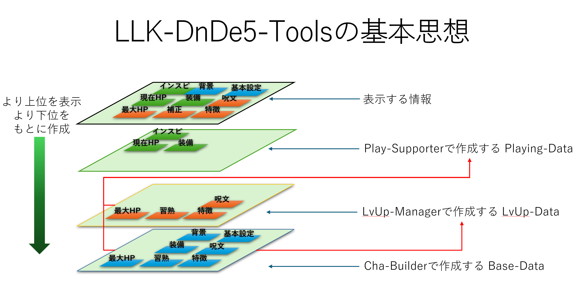

# 2026年01月 LLK例会 1/14までのキャラクタ作成アプリの実装状況と今後の予定
- 決定日: 2026/01/21

## ■ D&D5eレベルアップ管理アプリについて
- 最低限の実装は完成した認識です

    - [llkdn.com/app/trpg/dnd/pc/levelup](https://llkdn.com/app/trpg/dnd/pc/levelup)
- 操作方法には癖があるので、希望者がいれば本番前の 01/23(金)か01/24(土)の夜に解説します。

## ■ データの基本思想
- データの基本思想としては、管理対象を各管理で絞って言います。
    - 
- すなわち以下の3つです。
    - [D&D5ePC作成アプリ](https://llkdn.com/app/trpg/dnd/pc/)
    - [D&D5eLv管理アプリ](https://llkdn.com/app/trpg/dnd/pc/levelup)
    - D&D5e冒険支援アプリ
- また、これらは差分だけ持つと面倒なことになるので、ばっちり上書きます。
- なので、レベルアップごとに別のレベルアップデータを作っていきますが、データ管理の面倒な部分はシステムがやるのであまり気にすることなく、そのレベルで得た能力値だけポチポチすればよいはずです。
