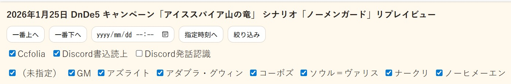

# 2026年01月 LLK例会 1/25の プレイログ について
- 決定日: 2026/01/27

## ■ セッション1 の プレイログ
- Discord書込/発言/Ccfolia書込をまとめたもの
- 発言を音声認識したものは精度が低いのでうざいなぁと思ったら、「絞り込み」→「Discord発話認識」のチェックを外して非表示にする

[2026年1月25日 DnDe5 キャンペーン「アイススパイア山の竜」 シナリオ「怒りの丘」リプレイビュー](https://llkdn.com/trpg/dnd/replay/icespire-mountain-dragon/20260125-session01.html)



## ■ セッション2 の プレイログ
- 1/25は2シナリを走る抜けたので2個目のセッションのプレイログはこちら
- 戦闘シーンが少なかったため2シナリオやりましたが、もう少し戦闘が多いと1シナリオになるかなと思います
- また、戦闘を増やしたいなとも思っています

[2026年1月25日 DnDe5 キャンペーン「アイススパイア山の竜」 シナリオ「ノーメンガード」リプレイビュー](https://llkdn.com/trpg/dnd/replay/icespire-mountain-dragon/20260125-session02.html)

- おまけで、セッション1～2のNPCと勢力の関係図です


## ■ リプレイビューの作成方法

### ◆ ログの取得方法
- Discord で LLK-concierge(コンシェルジュ・執事) がいる際に以下のコマンドでログが取得可能
```
!logs
```
- 詳細な使い方は、GitHubで公開している[discord-stt-tts-bot](https://github.com/ezmscrap/discord-stt-tts-bot/)の[使い方ページ](https://github.com/ezmscrap/discord-stt-tts-bot/blob/main/docs/usage.md)を参照

### ◆ ログの取得方法
- [ログ整形ツール(リプレイビュー作成)](https://llkdn.com/app/create-html/)で作成する

#### ▼ ログの整形手順の詳細
1. 「表示設定」の利用するログの期間「開始」と「終了」で切り出したい日時を仮決めして「期間を適用」する
2. 「CSVを選択」でログファイルを選択する
3. 「読み込み」でログファイルを読み込む
4. 置換設定JSONファイルがあれば、「置換」の「JSONを読み込む」で読み込み、「置換を適用」する
5. 「置換」で「ezmscrap」→「GM」などを決め、「置換を適用」する
6. 置換設定をJSONとして手元で保存したい場合、｢置換」の「置換設定JSONをダウンロード」で保存する