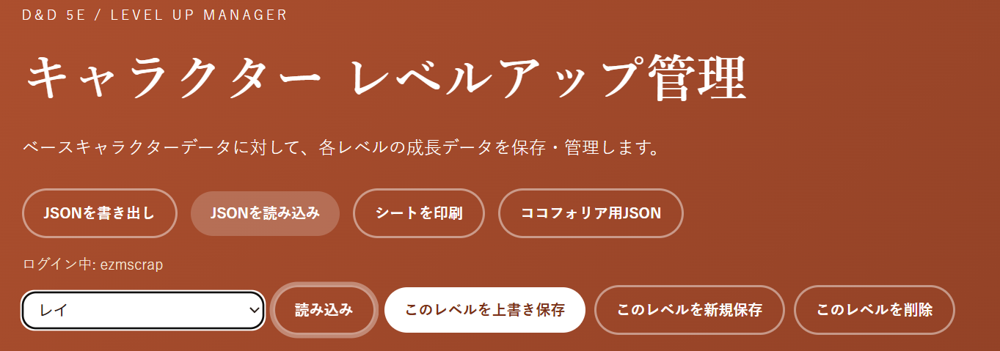
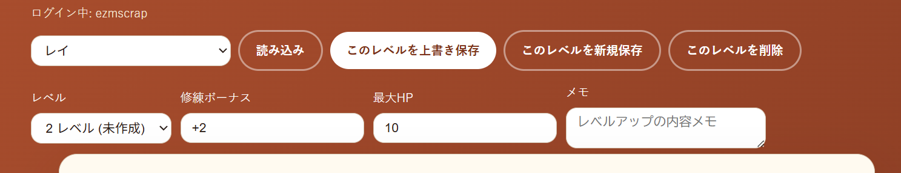
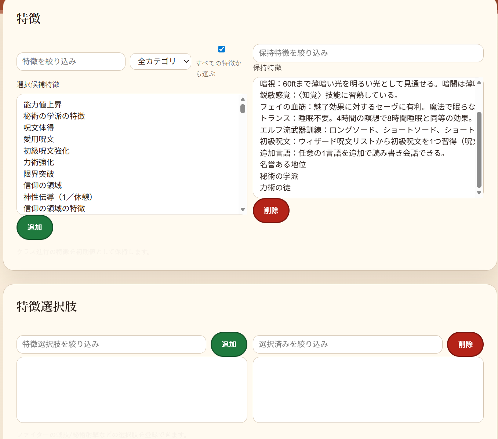
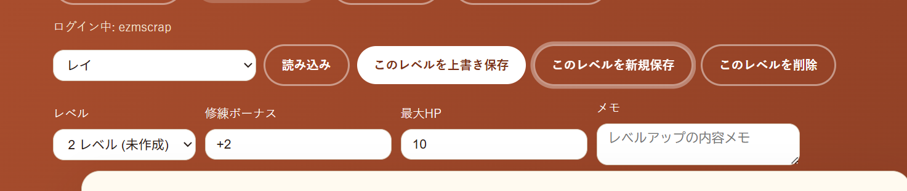

# 2026年01月 LLK例会 1/31のハクスラ体験会 と D&D5eレベルアップ管理アプリ、プレイ支援アプリ について
- 決定日: 2026/01/30

## ■ 開催概要
- 日程: 2026年01月31日(土) 13:00-18:00
- 場所: Discord + Ccfolia(前回と同じ)
    - 音声: [Discord LLKサーバ TRPG部](https://discord.com/channels/837718586868236378/837719282024185926)
    - ゲームボード: [ココフォリア-LLK-session-DnD5th-icespire-mountain-dragon](https://ccfolia.com/rooms/Uly6S0Acp)
- 参加: スキュラさん Lostさん Einさん 銀鍵さん + いずむ
- 内容: DnD5eでハックアンドスラッシュしようぜ!

## ■ 開催の目的
- 前回、足りなかった戦闘にフォーカスして遊ぶ
- 特に、 D&Dフィフスエディション戦闘ルールの慣熟したいとの考えがる
- レベルアップも体験したい Lv2で遊ぼう!

## ■ (あってなきがごとしの)シナリオ
- ファンダリンの獅子盾商会は同盟者であるノームからの仕入れを再開し、+1の魔法の武器を売り始めた
- しかし、当然お高いのでしょう? 当たり前です 250～500gpです!
- そんなおりに、交易所のハリアは、PCたちに2000枚近い金貨に興味はないかと話す
- ファンダリンからバタースカル牧場へと物資を運ぶ馬車に乗ること3日の地点
- 遠い過去にオークに滅ぼされた町コニーベリーの廃墟
- そこからほど近い場所にあるかつて社だった廃墟に財産を隠したとの記録が見つかったというのだ

## ツールへのリンクと各ツールの目的と手順
[DnD5eLv管理アプリ](https://llkdn.com/app/trpg/dnd/pc/levelup)

- 目的: キャラクターの原型は触らず、レベルアップで変わる差分だけを書き換える

### ◆ 1. キャラクターの読み込み

‐プルダウンメニューでキャラクターを選択し、「読み込み」

### ◆ 2. レベルを選ぶ

- ふつうは未作成の、いまのレベルの次のレベルを選ぶ

### ◆ 3. 最大HPを入力
- 最大HPをルールに従って増やした値を入力
- 値を決めるのは手動です

### ◆ 4. 特徴を確認する
- そのレベルで、クラスにより獲得できる特徴が、保持特徴に入っているか確認する
- 入っていなければ選択候補特徴から取得
- すべての特徴から選ぶをチェックしておくと、文字通りなんでも選べるはず
- 2段目は戦技など、極めて特殊な特徴を管理するためのもの

### ◆ 5. 保存する
- このレベルを新規保存する
- 基本的にはこれだけ

