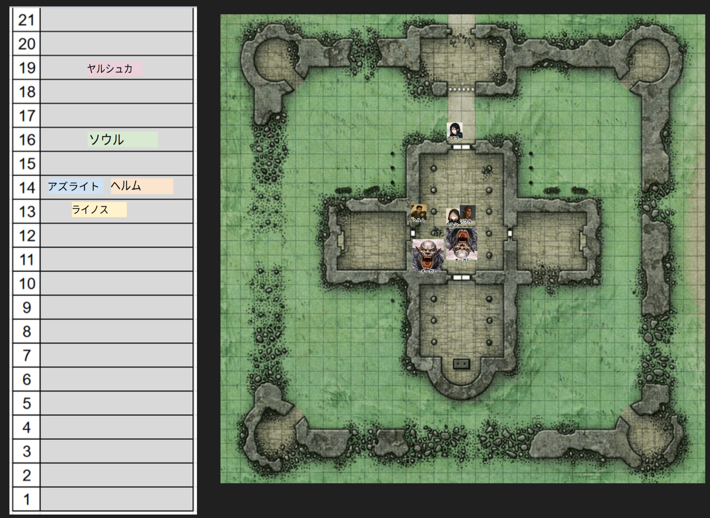
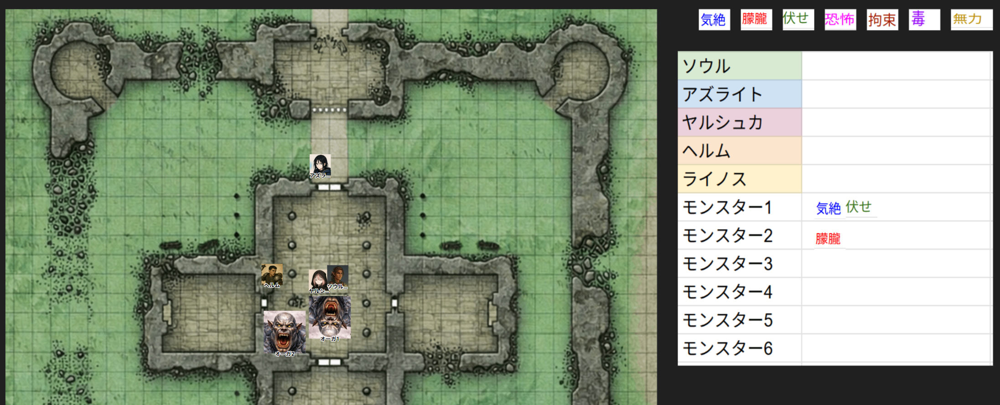

# 2026年02月 LLK例会 1/31の プレイログ について
- 決定日: 2026/02/01

## ■ セッション3 の プレイログ
- Discord書込/発言/Ccfolia書込をまとめたもの

[2026年1月31日 DnDe5 キャンペーン「アイススパイア山の竜」 シナリオ「サヴラスの社」リプレイビュー](https://llkdn.com/trpg/dnd/replay/icespire-mountain-dragon/20260131-session03.html)

## ■ プレイ後に出た意見

### ◆ チャットパレットに以下を追加
- 能力値ロール(能力ボーナスだけのロール)
- イニシアティブ判定
- 大業物の使い手 と 射撃の名手 の命中-5/ダメージ+10の特殊攻撃の命中ロール/ダメージロール

### ◆ イニシアチブ管理表をゲームボードに追加
- イニシアチブ管理表をクリックできない背景として配置
- 「PCの名前」チット、「敵の名前」チケット

### ◆状態異常管理表をゲームボードに追加
- 配置は考える
- 各キャラクター名を書いておき、そこに「状態異常名」のチットを置くか?

