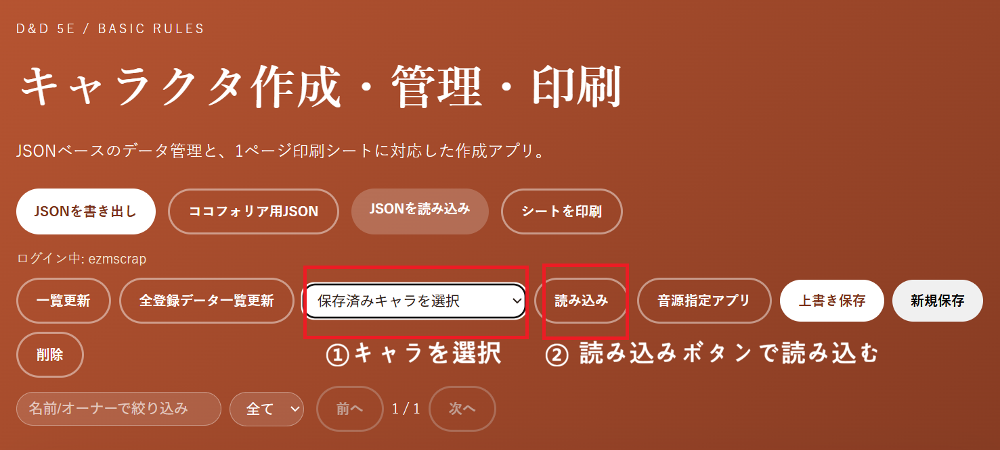
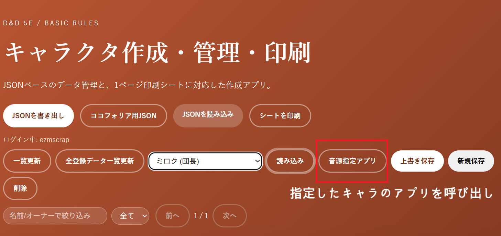
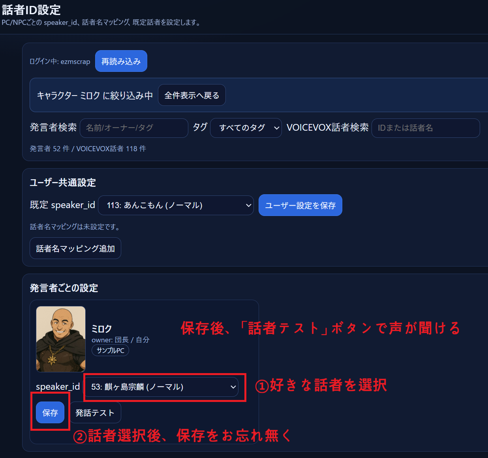

# 2026年02月 LLK例会 3月例会に向けた音源の設定について
- 決定日: 2026/02/28

## お願い: 音源の設定
- speaker_idを設定してもらいたい

- アズライト: 100: 黒沢冴白
- ソウル＝ヴァリス: 52: 雀松朱司
- ヘルム: 11:  玄野武弘
- ヤルシュカ: 9: 波音リツ
- ライノス: 51: †聖騎士 紅桜†

## 手順

### 1. キャラ作成アプリでキャラを指定

### 2. 音声指定アプリを呼び出し

### 3. 音声IDを設定

