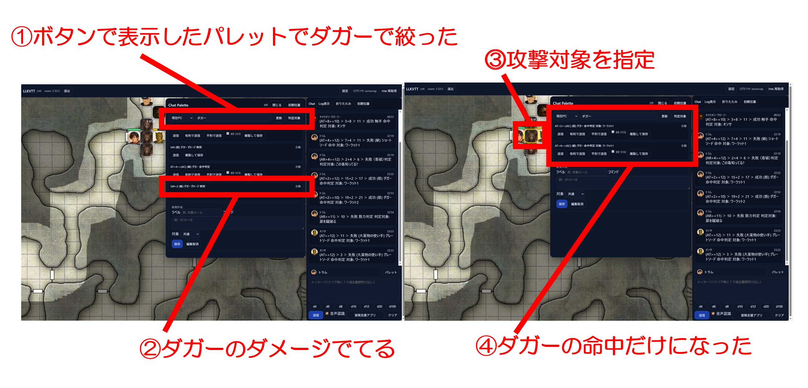
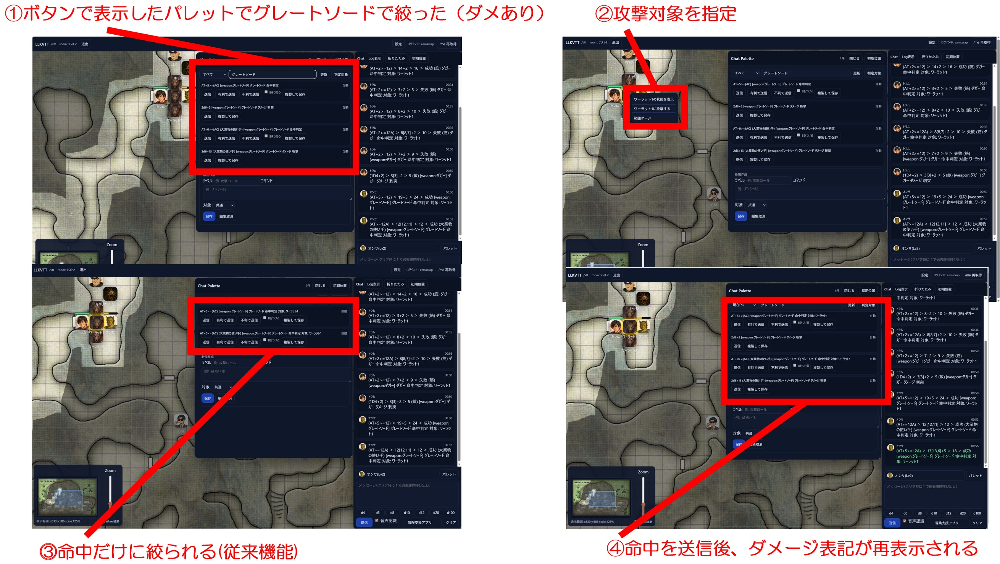
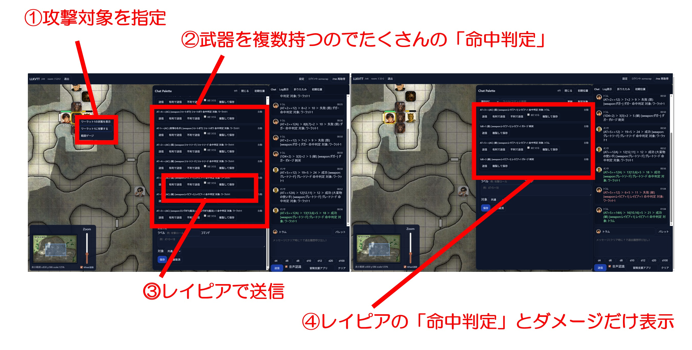
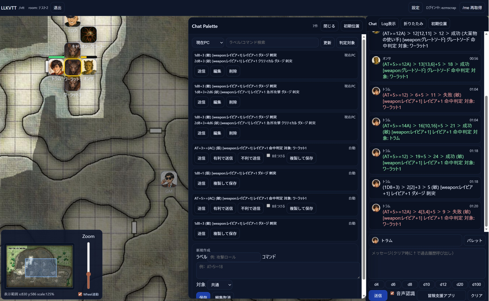

# 2026年03月 LLK例会 命中判定後、ダメージ判定をすぐにできるようにしたい件について
- 決定日: 2026/03/11

## ■ 報告
> そういえば、L-VTTの挙動の話なんですが
グレートソードでチャットパレット検索
↓
命中判定を行う
↓
ダメージ判定のパレットが消えて
命中判定のパレットだけ残る挙動がありましたね

by @skylla6

## ■確認
以下の症状を確認しました。
1. ボタンからパレットを呼び出し
2. パレットで武器名で絞り込む
3. その武器の命中判定とダメージ判定が表示される
4. トークンを右クリックで攻撃対象を指定
5. その武器の命中判定だけになり、ダメージ判定が消える

2/10時点では、これは仕様でした。

## ■ 応答
Yes by @skylla6

## ■機能改善: 命中判定後にダメージ判定を表示する

## ■補足1: 命中判定に使った武器のダメージ判定を自動表示

## ■補足2: 具体的な使い方

- [weapon: xxx] を使って紐付けています。
- クリティカル、急所攻撃、クリティカル＋急所攻撃 などなど、複雑怪奇なパターンを作成した場合、[weapon: xxx] を残して下さい。
- コマンドの方に [weapon: xxx] を残しておけば関連付けて自動で命中判定後に表示してくれます。
- なお、[weapon:xxx]は読み上げません。

