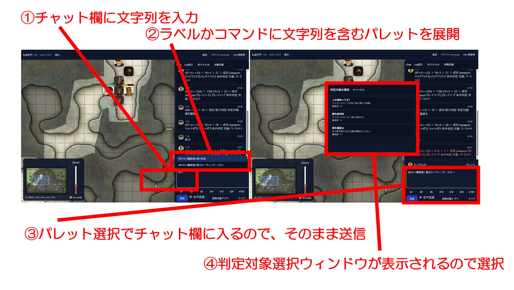
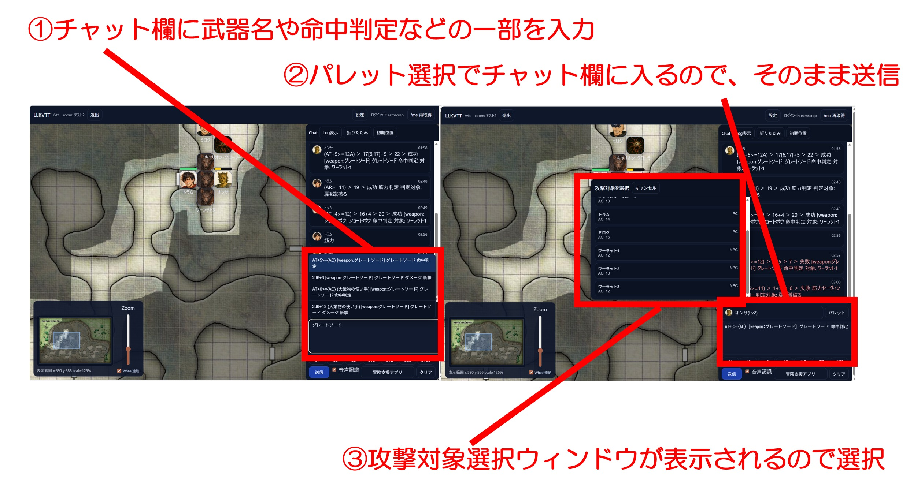
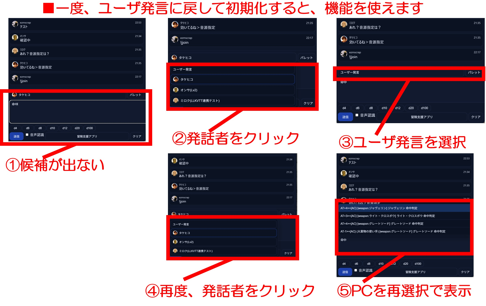

# 2026年03月 LLK例会 ココフォリア風の、チャット欄でのパレット絞り込みについて
決定日: 2026/03/11

- @theSilverKey さんから、ココフォリア風の、チャットでのパレット絞り込みが欲しいとの意見を得ました。
- 判定対象の選択もパレットからの送信と同様に出来るようにしました。
- AやBやDの追加は手動入力で一つ。

## ■チャットパレットのチャット欄での絞り込みについて

1. チャット欄に文字列を入力
2. ラベルかコマンドに文字列を含むパレットを展開
3. パレット選択中はカーソルキーの↑↓で選択可能
4.  選択決定したパレット選択でチャット欄に入る
5. そのまま送信しても良いし、修正してから送信しても良い
6. コマンドに"{難易度}"が含まれる場合、判定対象ウィンドウが展開する

## ■チャット欄でのパレット絞り込みによる攻撃について

- 命中判定やダメージなどもこの方式から指定可能です。
- ただし、名前をみての選択なので、攻撃を誤爆しやすい可能性があるので注意してください。
- 味方も殴れるのは仕様です(たまに、味方を殴る必要がある場面はあるので)。

## ■補足 : チャット欄でのパレット絞り込み機能の初期化
- この機能は、ユーザ入力を横取りしている都合上、一度、初期化が必要です。
- 発話者を「ユーザ発言」(初期値)に切り替え手から、改めてPCを選び直して下さい。

