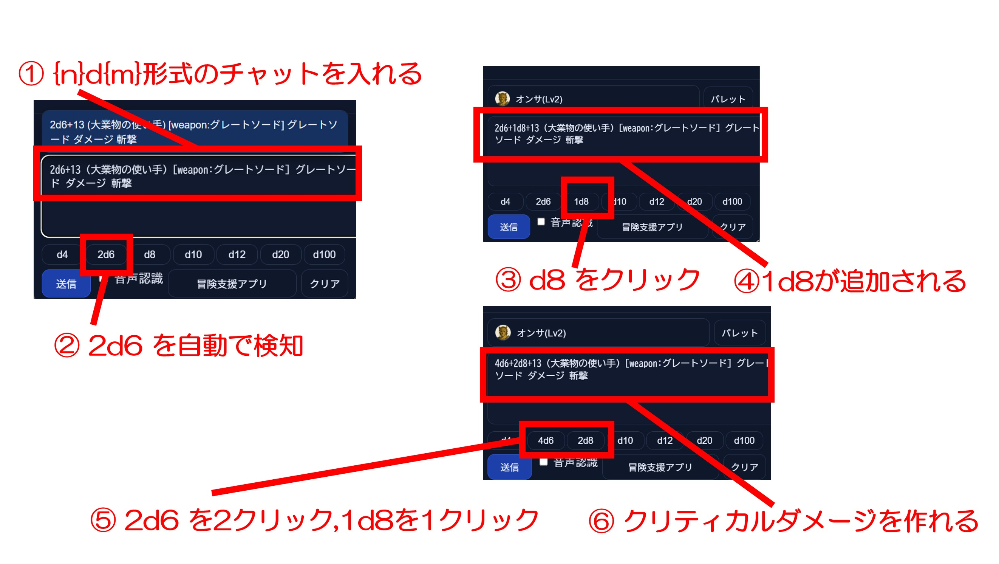

# 2026年03月 LLK例会 ダメージダイスの手動修正と戦士・パラディンの両手武器対応
決定日: 2026/03/13

## ■ ダメージダイスをクイックダイスボタンで制御する

1. 「2d6+3 グレートソード ダメージ」のようなチャット欄への入力があるとする
2. 上記のチャット欄への入力が合った場合、クイックダイスボタンの d6 が 「2d6」になる。
3. 戦技ダイスの 1d8 を足したければ、 クイックダイスボタンの d8 をクリックする。
4. チャット欄のダメージダイスの位置に +1d8 が追加される。
5. クイックダイスボタンの 2d6 をクリックすると ボタンもチャット欄も 3d6 になる。
6. クイックダイスボタンの 3d6 をクリックすると ボタンもチャット欄も 4d8 になる。
7. クイックダイスボタンの 1d8 をクリックすると ボタンもチャット欄も 2d8 になる。
8. 5～6を上手くやればクリティカルダメージのチャットを作れる。

## ■戦士・パラディンの 両手武器戦闘 について

- ダメージダイスに「手動で」 "2H" を先頭に付与することで 出目が 1,2 のときに際ロールする処理を自動で解決する。(以下は凡例)
    - 2H1d12
    - 2H2d6

