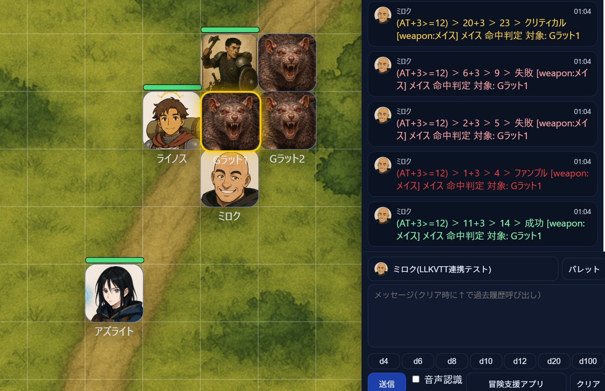
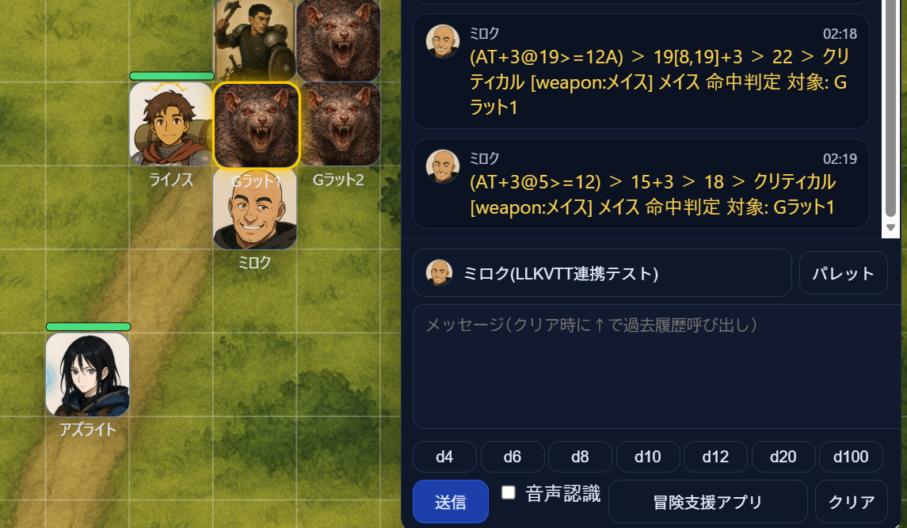

# 2026年03月 LLK例会 ココフォリア風の、チャット欄でのパレット絞り込みについて
決定日: 2026/03/14

## ■ 命中判定時にクリティカルあるいはファンブルなら文字色を変更するようにした

- クリティカル → 金色(黄色)
- 成功 → 薄い緑
- 失敗 → 薄い赤
- ファンブル → 深い赤

## ■ クリティカルになる出目の指定が可能になった

- 目標値の手前に @ と 数字を指定すると、その数字以上でクリティカルになる。(以下は凡例)
    - AT@19>={AC}
    - AT+2@19>={AC}
    - AT-1@19>={AC}D
    - AR@19>={難易度}
    - AR+2@19>={難易度}
    - AR-1@19>={難易度}D
- @19 でなく 極端に低くしても動く (例えば @5)

