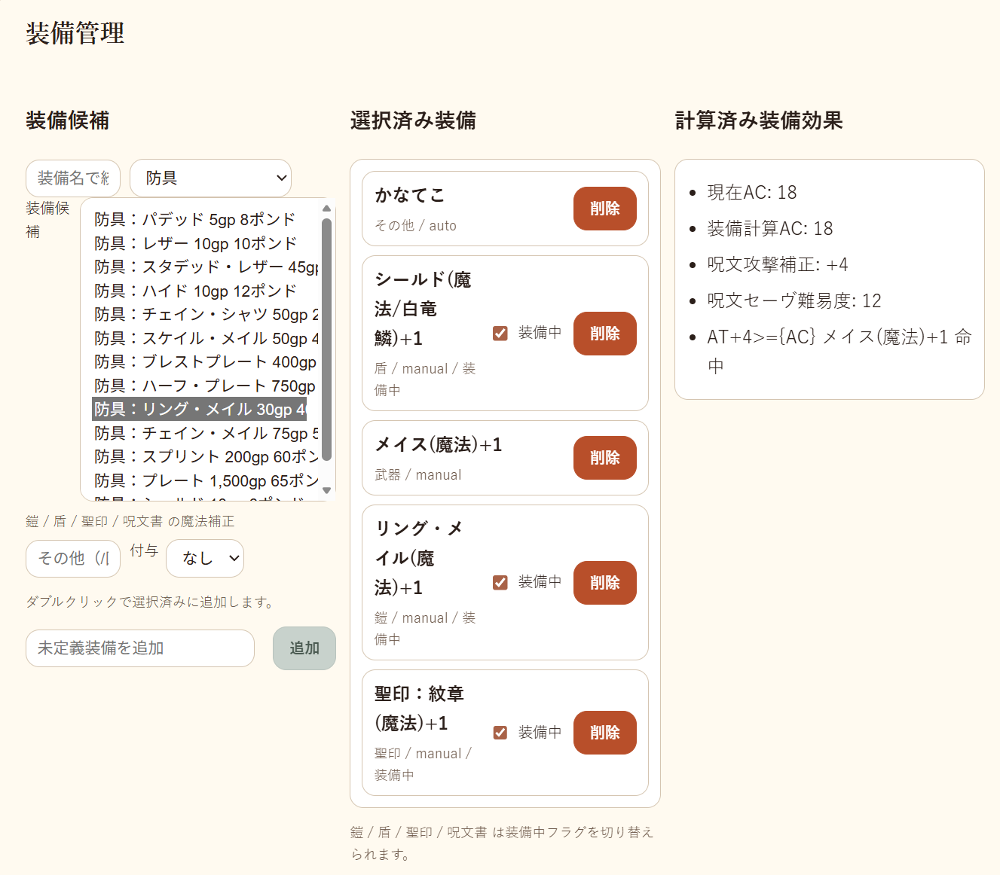
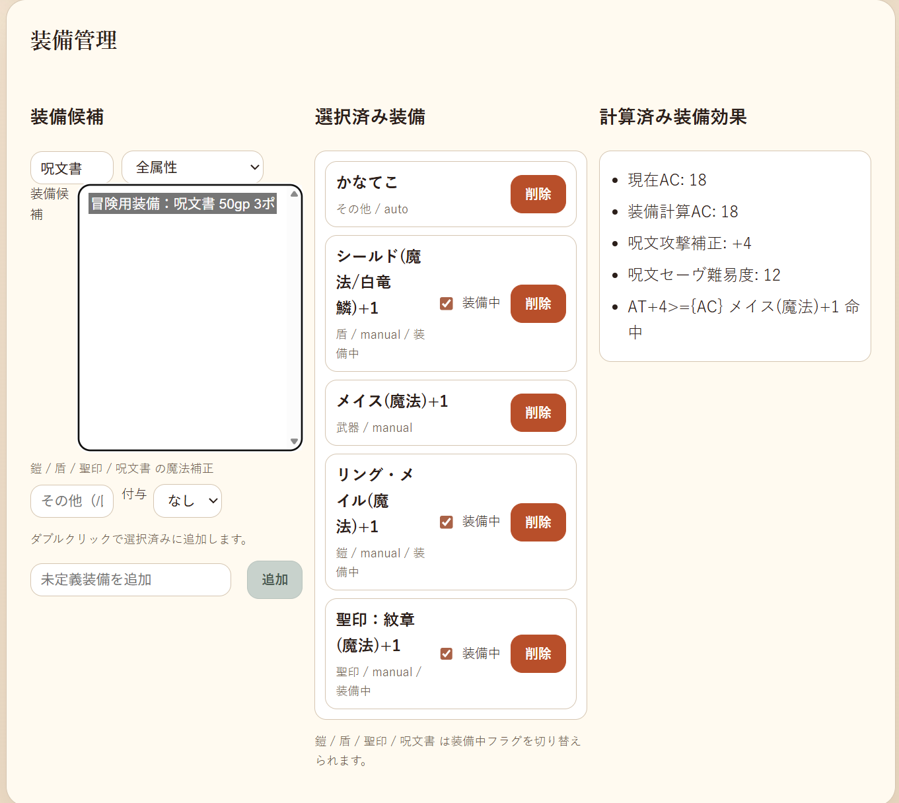
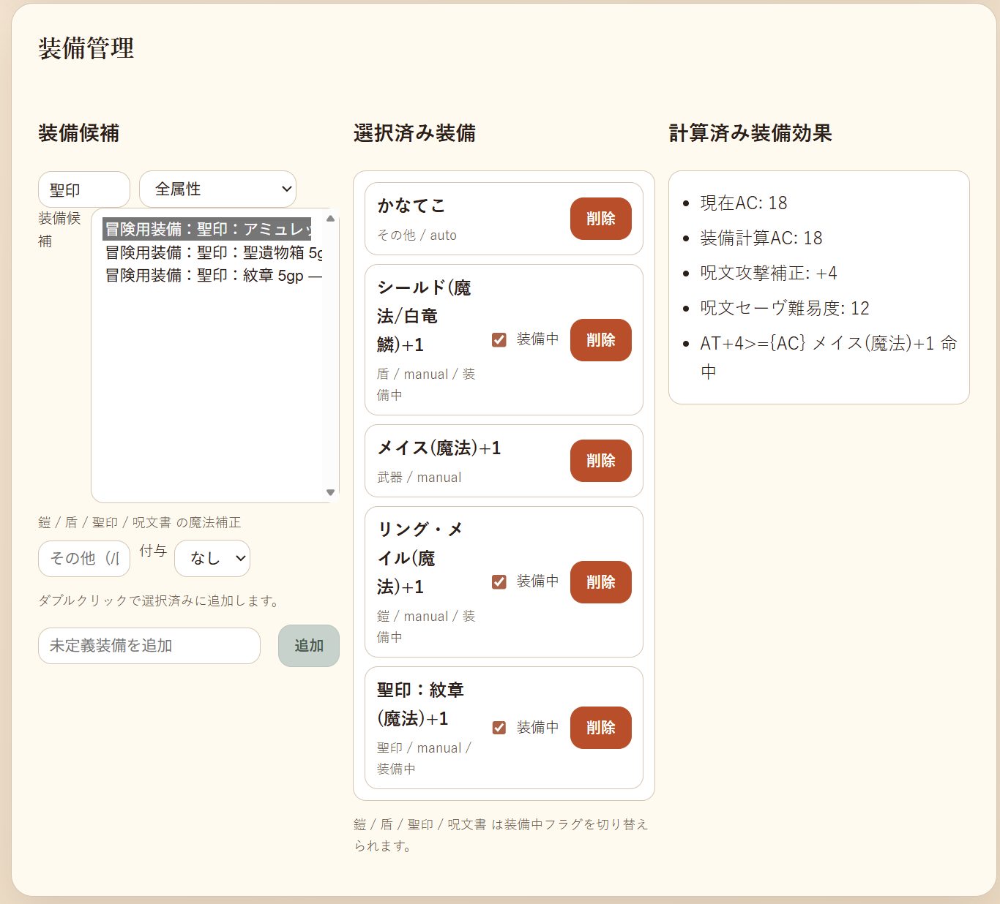

# 2026年03月 LLK例会 魔法の鎧、盾、呪文書、聖印について
決定日: 2026/03/16

## 魔法の鎧について

1. 装備候補 の上部の分類選択で「防具」を選択する
2. 装備候補 で任意の鎧を選択
3. 魔法の鎧なら付与された修正に合わせて付与を「なし」から+1～+3を選ぶ
4. 「ドラゴンスケイル(竜鱗)」などの属性を付けたい場合、「その他」に文字列を設定する
5. 装備候補 の 任意の鎧 をダブルクリックで、 選択済み装備に送る
6. 必要なら、装備中のチェックボックスにチェックを入れる
7. 現在ACは手動で設定するプレイ中のACなので、装備計算ACに合わせて計算する

## 魔法の盾について

1. 装備候補 の上部のフォームに「シールド」と入力して絞り込む
2. 装備候補 で「シールド」を選択
3. 魔法の盾なら付与された修正に合わせて付与を「なし」から+1～+3を選ぶ
4. 「ドラゴンスケイル(竜鱗)」などの属性を付けたい場合、「その他」に文字列を設定する
5. 装備候補 の 「シールド」 をダブルクリックで、 選択済み装備に送る
6. 必要なら、装備中のチェックボックスにチェックを入れる
7. 現在ACは手動で設定するプレイ中のACなので、装備計算ACに合わせて計算する

## 魔法の呪文書について

「アーケイン・グリムワー」はデータ的には「呪文書+1/+2/+3」として扱う。

1. 装備候補 の上部のフォームに「呪文書」と入力して絞り込む
2. 装備候補 で「呪文書」を選択
3. 魔法の呪文書なら付与された修正に合わせて付与を「なし」から+1～+3を選ぶ
4. 「アーケイン・グリムワー」などの属性を付けたい場合、「その他」に文字列を設定する
5. 装備候補 の 「呪文書」 をダブルクリックで、 選択済み装備に送る
6. 必要なら、装備中のチェックボックスにチェックを入れる
7. 計算済み装備効果の呪文攻撃補正、呪文セーヴが正しいことを確認する

## 魔法の聖印について

「アミュレット・オヴ・ザ・ディヴァウト」はデータ的には「聖印+1/+2/+3」として扱う。

1. 装備候補 の上部のフォームに「聖印」と入力して絞り込む
2. 装備候補 で「聖印」を選択
3. 魔法の聖印なら付与された修正に合わせて付与を「なし」から+1～+3を選ぶ
4. 「アミュレット・オヴ・ザ・ディヴァウト」などの属性を付けたい場合、「その他」に文字列を設定する
5. 装備候補 の 「聖印」 をダブルクリックで、 選択済み装備に送る
6. 必要なら、装備中のチェックボックスにチェックを入れる
7. 計算済み装備効果の呪文攻撃補正、呪文セーヴが正しいことを確認する

