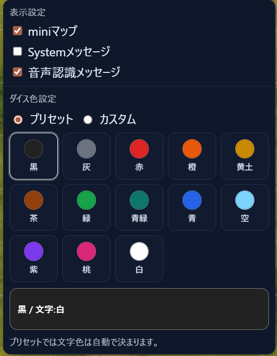
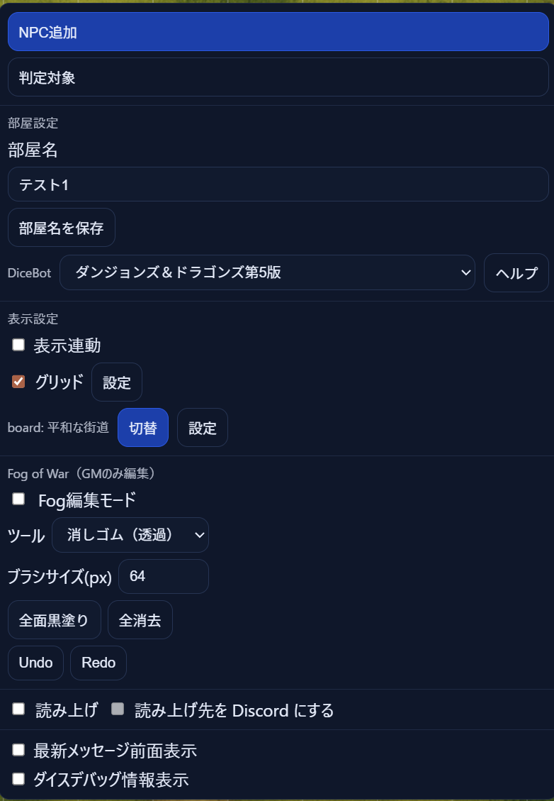
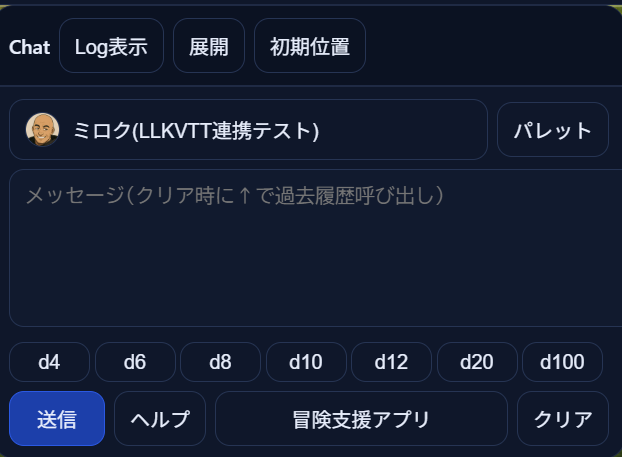
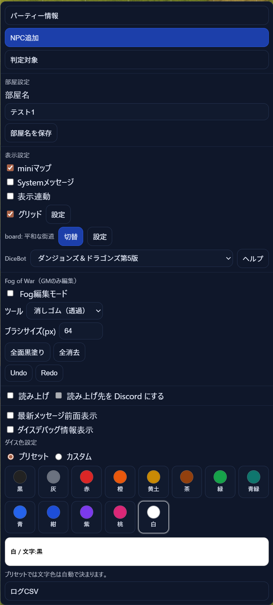

# 2026年04月 LLK例会 04/18における 設定ウィンドウの調整 について
- 決定日: 2026/04/18

## ■ 設定ウィンドウの調整

### ◆ 新しい設定ウィンドウ 
- miniマップ: ゲームボード上のミニマップの表示、非表示を切り替える
- Systemメッセージ: Chatウインドウ上のシステムメッセージ(トークン数値変更など)の表示/非表示を切り替える
- 音声認識メッセージ: Chatウインドウ上の音声認識した結果のメッセージの表示/非表示を切り替える
- ダイス色設定: プリセット色かカスタム色かを選択肢、その後でさらに色を選択する

### ◆ 追加された GM設定ウィンドウ 
- NPC追加: 
- 判定対象:
- 部屋名:
- ChatBot:
- 表示連動:
- グリッド:
- グリッド設定:
- Board:
- Bord切替:
- Board設定:
- Fog編集モード:
- Fog編集ツール:
- Fog編集ブラシサイズ:
- Fog編集全面黒塗り:
- Fog編集全消去:
- Fog編集Undo:
- Fog編集Redo:
- 読み上げ:
- 読み上げ先をDiscordにする:
- 最新メッセージを前面表示:
- ダイスデバッグ情報表示:

### ◆ ヘルプを追加したチャットインプット欄
- 発言者: 発言者を選択する
- パレット: チャットパレットを表示する
- メッセージ欄: 送信するメッセージを入力するインプットフォーム
- d4/d6/d8/d10/d12/d20/d100:指定したダイスロール命令をメッセージ欄に送る(通称"クイックダイス")
- 送信: メッセージ欄に書かれたメッセージを送信する
- ヘルプ: DiceBotのヘルプを表示する
- 冒険支援アプリ: 発言者の冒険支援アプリをブラウザの別タグで起動する
- クリア: メッセージ欄をクリアする

### ◆ 以前の設定ウィンドウ
- 元の設定ウィンドウは以下のような形式だった

