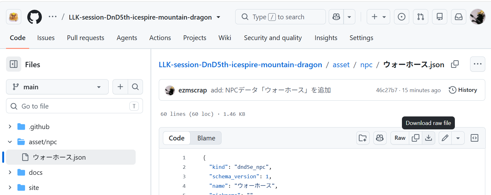
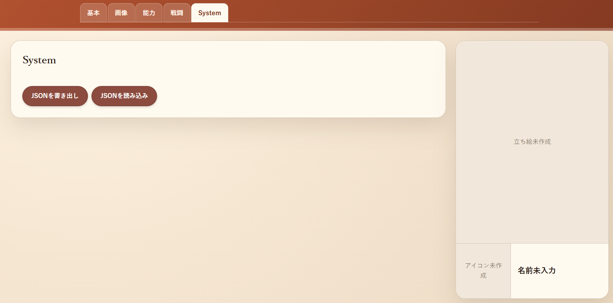
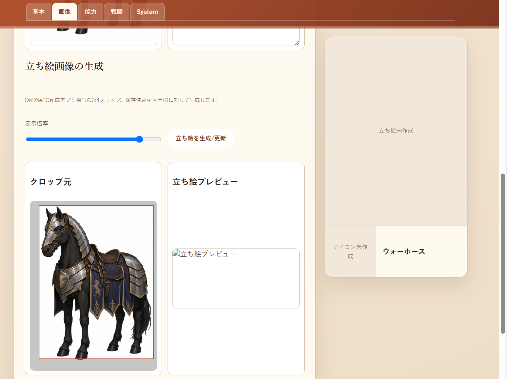
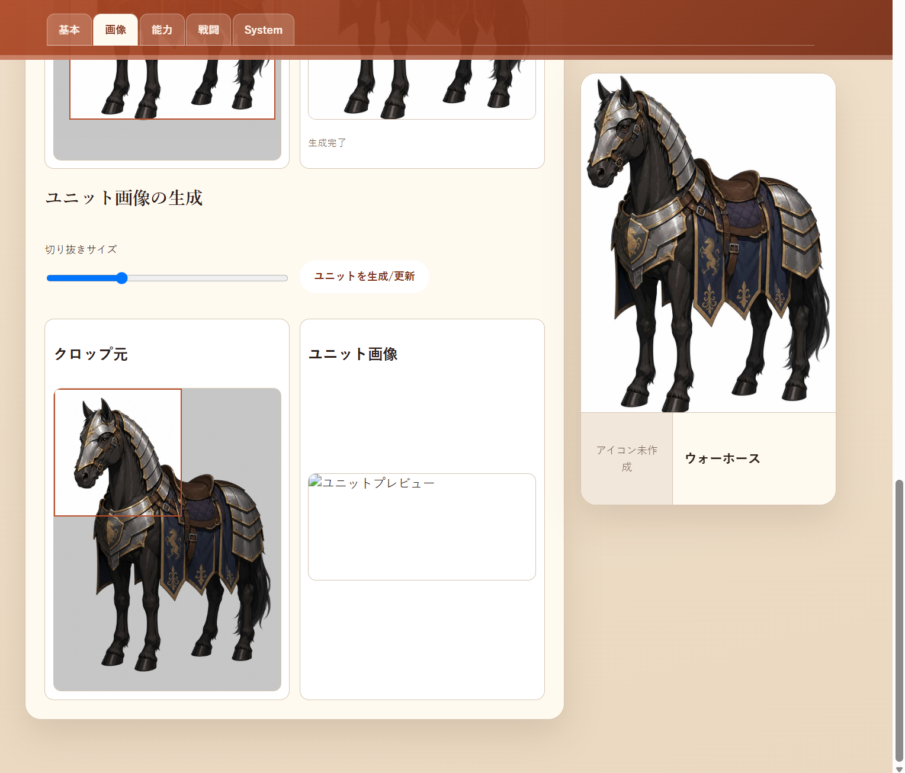
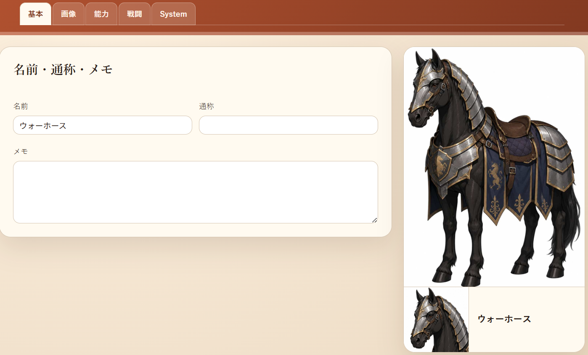

# 2026年07月 LLK例会 07/30の NPCデータの 読み込み について
- 決定日: 2026/07/30

## ■ NPCデータのJSONを用いた簡易作成

[プレイヤーが使うNPC](../2026-07-12/)の手順を書いたが、
動物データなどは、モンスターマニュアルがなければわからないなどの問題もある。

そのため、必要ならばDMが依頼を受け、DMが作成したNPCデータの JSONファイルを共有し、
[NPC作成アプリ](https://llkdn.com/app/trpg/dnd/npc/)の「System」タグの「JSON読み込み」ボタンからJSONファイルを読み込むことで
簡単にNPCを作る方法も用意した。

まずは、パラディン呪文「ファインド・スティード」用のウォーホースのデータを共有する。

- [ウォーホース](https://github.com/ezmscrap/LLK-session-DnD5th-icespire-mountain-dragon/blob/main/asset/npc/warhorse.json)

### ● JSONファイルを取得

各データのリンク先の "Download raw file"からJSONファイルを取得する。

### ● NPC作成アプリでJSONファイルを読み込み

[NPC作成アプリ](https://llkdn.com/app/trpg/dnd/npc/)の「System」タグの「JSON読み込み」ボタンからJSONファイルを読み込む。

### ● 立ち絵を生成

[NPC作成アプリ](https://llkdn.com/app/trpg/dnd/npc/)の「画像」タグの下の方にある 「立ち絵画像の生成」で「立ち絵を生成/更新」ボタンを押下する。

### ● ユニット画像を生成

[NPC作成アプリ](https://llkdn.com/app/trpg/dnd/npc/)の「画像」タグの一番下にある 「ユニット画像の生成」で「ユニットを生成/更新」ボタンを押下する。

### ● 名前/能力/戦闘関係ステータスの変更して上書き保存

[NPC作成アプリ](https://llkdn.com/app/trpg/dnd/npc/)の「基本」タグで「名前」の変更ができる。

同様に、「能力」タグで能力値、「戦闘」タグでACやHP、攻撃手段などを変更できる。

変更後は必ず「上書き保存」を押下する。

