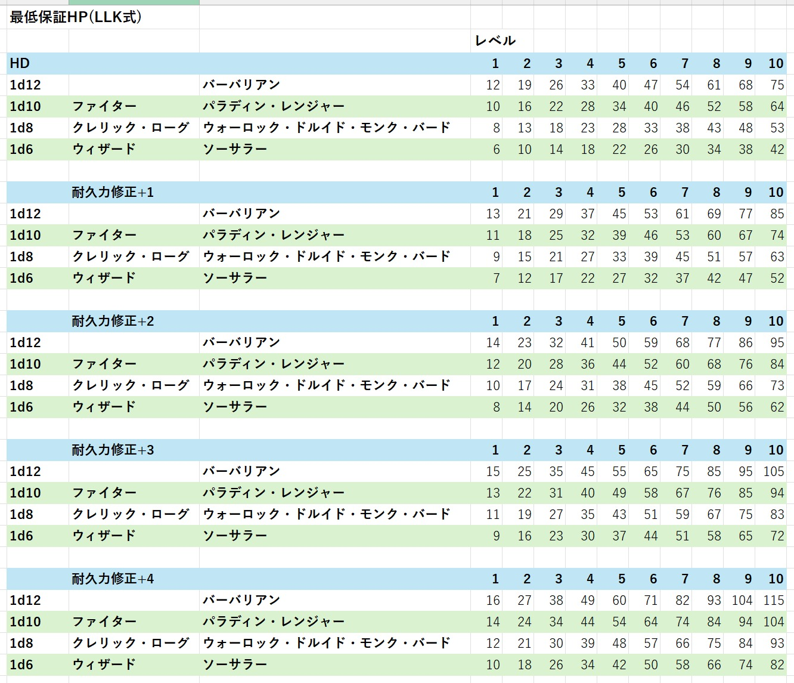

## ■概要
- 2026年01月から開始するLLK例会でのDungeons & Dragons 5th Editionを使用したキャンペーンに関する情報をまとめたページです。

- 使用するシナリオは「アイススパイア山の竜」です。

## ■日程
- 2026/01/09(金) 20:00-22:00 相談日1 EINさん, 銀健さん 
- 2026/01/10(土) 20:00-22:00 相談日2 Lostさん, スキュラさん
- 2026/01/11(日) 20:00-22:00 相談日3 草霞さん, スキュラさん
- 2026/01/12(月) 20:00-22:00 相談日4 EINさん, 銀健さん, Lostさん
- 2026/01/19(月) 22:00 キャラクタシート提出期限
- 2026/01/22(木) 種族とキャラクタの背景の決定の目標日
- 2026/01/23(金) 22:00 キャラクタの背景と設定の提出期限
- 2026/01/25(日) 13:00-18:00 セッション1回目
- 2026/01/31(土) 13:00-18:00 セッション1.5回目 ハクスラ体験
- 2026/02/05(木) 21:30-22:30 相談日5 草霞さん
- 2026/02/11(水) 13:00-18:00 セッション2回目
- 2026/03/01(日) 13:00-18:00 セッション3回目
- 2026/03/08(日) 13:00-18:00 セッション4回目
- 以降、月に1～2回のペースでセッションを開催予定、全8～12回くらいを予定

## ■参加者 / クラス
キャンペーンでルイーダの酒場方式なので、IN/OUT自由

- スキュラさん / ファイター  
- 草霞さん / パラディン 
- Lostさん / クレリック 
- 銀健さん / ローグ 
- EINさん / ウィザード 

## ■最低保証HP

- [もっと大きな画像を見る](./2026-02-04/)

## ■ 関連リンク

### ◆ LLK例会 開催場所 について
- 音声: [Discord LLKサーバ TRPG部](https://discord.com/channels/837718586868236378/837719282024185926)
- ゲームボード: [ココフォリア-LLK-session-DnD5th-icespire-mountain-dragon](https://ccfolia.com/rooms/Uly6S0Acp)

### ◆ プレイログ(リプレイビュー)
- [2026年1月25日 シナリオ「怒りの丘」](https://llkdn.com/trpg/dnd/replay/icespire-mountain-dragon/20260125-session01.html)
- [2026年1月25日 シナリオ「ノーメンガード」](https://llkdn.com/trpg/dnd/replay/icespire-mountain-dragon/20260125-session02.html)
- [2026年1月31日 シナリオ「サヴラスの社」](https://llkdn.com/trpg/dnd/replay/icespire-mountain-dragon/20260131-session03.html)
- [2026年2月11日 シナリオ「嵐の塔」](https://llkdn.com/trpg/dnd/replay/icespire-mountain-dragon/20260211-session04.html)

### ◆ LLKツール/DnD5eのPC管理系ツール
- [DnD5ePC閲覧アプリ](https://llkdn.com/app/trpg/dnd/pc/viewer/)
- [DnD5ePC作成アプリ](https://llkdn.com/app/trpg/dnd/pc/)
- [DnD5eLv管理アプリ](https://llkdn.com/app/trpg/dnd/pc/levelup)
- [DnD5e冒険支援アプリ](https://llkdn.com/app/trpg/dnd/pc/playing/)

### ◆ LLKツール/DnDe5の画像での支援ツール
- [DnDe5肖像画作成アプリ](https://llkdn.com/app/create-img/dnd/pc/)
- [DnDe5肖像画管理アプリ](https://llkdn.com/app/create-img/dnd/viewer/)
- [DnD5eユニット画像一覧](https://llkdn.com/app/create-img/dnd/viewer/units/)

### ◆ LLKツール/その他ツール
- [DnD5e設定支援アプリ](https://llkdn.com/app/create-sound/dnd/pc/)
- [野良騎士仮想テーブルトップ(LLKVTT)](https://llkdn.com/app/trpg/vtt/)
- [VTT地図画像作成アプリ](https://llkdn.com/app/create-img/vtt/map/)
- [ログ整形ツール(リプレイビュー作成)](https://llkdn.com/app/create-html/)

### ◆[ココフォリア](https://ccfolia.com/)
- [LLK-session-DnD5th-icespire-mountain-dragon](https://ccfolia.com/rooms/Uly6S0Acp)

### ◆ [D&D日本語公式ツール](https://dnd-jp.com/tools/)
- [D&D プレイヤー用ベーシック・ルール日本語版 PDF版](https://dnd-jp.com/wp-content/uploads/2024/06/DnD-PlayerBasicRules-wotc2024-1.pdf)
- [D&D DM用ベーシック・ルール日本語版 PDF版](https://dnd-jp.com/wp-content/uploads/2024/06/DnD-DMBasicRules-wotc2024-1.pdf)  

### ◆ [フィフスエディションRPG サポートページ](https://hj-trpg.com/news/detail.html?id=1439)
似て非なるそっくりさんなので参考までに
- [5e RPGコアルールブック PDF版](https://wit-awscms-witweb.s3-ap-northeast-1.amazonaws.com/hjcardgamer/5eRPG_Core_20240423.pdf) 

### ◆ この記事のリポジトリ
- [LLK-session-DnD5th-icespire-mountain-dragon](https://github.com/ezmscrap/LLK-session-DnD5th-icespire-mountain-dragon)

■これまでの記事 
- [2026年02月 LLK例会 2/9時点における3月例会日程調整について](./2026-02-09/)
- [2026年02月 LLK例会 2/4時点における最低保証HPについて](./2026-02-04/)
- [2026年02月 LLK例会 2/1時点における1/31の プレイログ について](./2026-02-01/)
- [2026年01月 LLK例会 1/31のハクスラ体験会 と D&D5eレベルアップ管理アプリ、プレイ支援アプリ について](./2026-01-30/)
- [2026年01月 LLK例会 1/25の プレイログ について](./2026-01-27/)
- [2026年01月 LLK例会 1/25の 例会開催場所 について](./2026-01-25/)
- [2026年01月 LLK例会 1/22時点の DnD5eキャラクター閲覧アプリ と 依頼 について](./2026-01-22/)
- [2026年01月 LLK例会 1/21時点のD&D5eレベルアップ管理アプリについて](./2026-01-21/)
- [2026年01月 LLK例会 1/20時点のキャラクターイラスト管理アプリについて](./2026-01-20/)
- [2026年01月 LLK例会 1/19時点のキャラクターイラスト作成アプリについて](./2026-01-19/)
- [2026年01月 LLK例会 1/17までのキャラクタ作成アプリの実装状況と参加者の皆様へのお願い](./2026-01-17/)
- [2026年01月 LLK例会 1/14までのキャラクタ作成アプリの実装状況と今後の予定](./2026-01-14/)
- [2026年01月 LLK例会 1/11までのパーティ構成相談結果と準備状況](./2026-01-11/)
- [2026年01月 LLK例会 1/9までのキャラクタ構成に関する相談日と今後の予定](./2026-01-09/)
- [2026年01月 LLK例会 1/6までの参加者とクラス希望とパーティ構成相談](./2026-01-06/)
- [2026年01月 LLK例会 1/5までの意見、確認、質問、連絡への回答とスケジュールの追加](./2026-01-05/)
- [2026年01月 LLK例会 参加者募集の件](./2026-01-04/)
