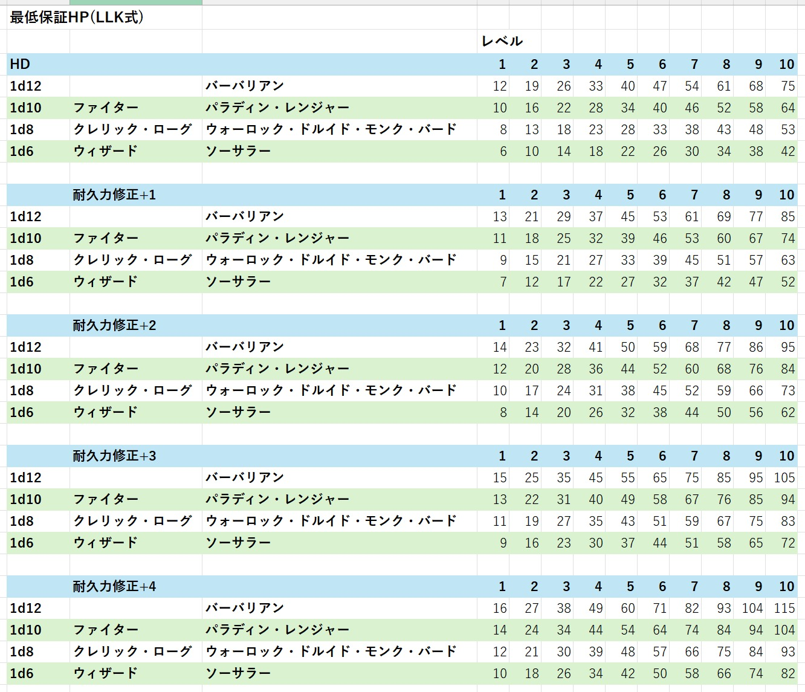

## ■概要
- 2026年01月から開始するLLK例会でのDungeons & Dragons 5th Editionを使用したキャンペーンに関する情報をまとめたページです。

- 使用するシナリオは「アイススパイア山の竜」です。

## ■日程
- 2026/01/09(金) 20:00-22:00 相談日1 EINさん, 銀健さん 
- 2026/01/10(土) 20:00-22:00 相談日2 Lostさん, スキュラさん
- 2026/01/11(日) 20:00-22:00 相談日3 草霞さん, スキュラさん
- 2026/01/12(月) 20:00-22:00 相談日4 EINさん, 銀健さん, Lostさん
- 2026/01/19(月) 22:00 キャラクタシート提出期限
- 2026/01/22(木) 種族とキャラクタの背景の決定の目標日
- 2026/01/23(金) 22:00 キャラクタの背景と設定の提出期限
- 2026/01/25(日) 13:00-18:00 シナリオ1,2回目
- 2026/01/31(土) 13:00-18:00 シナリオ3回目 ハクスラ体験
- 2026/02/05(木) 21:30-22:30 相談日5 草霞さん
- 2026/02/11(水) 13:00-18:00 シナリオ4回目
- 2026/03/01(日) 13:00-18:00 シナリオ5回目
- 2026/03/08(日) 13:00-18:00 シナリオ6回目
- 2026/04/12(日) 13:00-18:00 シナリオ7回目
- 2026/04/19(日) 13:00-18:00 シナリオ8回目
- 2026/05/10(日) 13:00-18:00 シナリオ9回目(予定)
- 以降、月に1～2回のペースでセッションを開催予定、全8～12回くらいを予定

## ■参加者 / クラス
キャンペーンでルイーダの酒場方式なので、IN/OUT自由

- スキュラさん / ファイター  
- 草霞さん / パラディン 
- Lostさん / クレリック 
- 銀健さん / ローグ 
- EINさん / ウィザード 

## ■最低保証HP

- [もっと大きな画像を見る](./2026-02-04/)

## ■ 3/1 のお願い: 音源設定(前回までの設定)
- アズライト: 100: 黒沢冴白
- ソウル＝ヴァリス: 52: 雀松朱司
- ヘルム: 11:  玄野武弘
- ヤルシュカ: 9: 波音リツ
- ライノス: 51: †聖騎士 紅桜†

[引用元](./2026-02-28/)

## ■ 関連リンク

### ◆ LLK例会 開催場所 について
- 音声: [Discord LLKサーバ TRPG部](https://discord.com/channels/837718586868236378/837719282024185926)
- ゲームボード: [LLKVTT-アイススパイア山の竜](https://llkdn.com/app/trpg/vtt/?room=48f91291-3b9e-447b-9bb3-321e59b7d352)

### ◆ プレイログ(リプレイビュー)
- [2026年01月25日 シナリオ「怒りの丘」](https://llkdn.com/trpg/dnd/replay/icespire-mountain-dragon/20260125-session01.html)
- [2026年01月25日 シナリオ「ノーメンガード」](https://llkdn.com/trpg/dnd/replay/icespire-mountain-dragon/20260125-session02.html)
- [2026年01月31日 シナリオ「サヴラスの社」](https://llkdn.com/trpg/dnd/replay/icespire-mountain-dragon/20260131-session03.html)
- [2026年02月11日 シナリオ「嵐の塔」](https://llkdn.com/trpg/dnd/replay/icespire-mountain-dragon/20260211-session04.html)
- [2026年03月01日 シナリオ「山裾金鉱」](https://llkdn.com/trpg/dnd/replay/icespire-mountain-dragon/20260301-session05.html)
- [2026年03月08日 シナリオ「アックスホルム」](https://llkdn.com/trpg/dnd/replay/icespire-mountain-dragon/20260308-session06.html)
- [2026年04月12日 シナリオ「竜の塚」](https://llkdn.com/trpg/dnd/replay/icespire-mountain-dragon/20260412-session07.html)
- [2026年04月19日 シナリオ「雷鳴の環状列石」](https://llkdn.com/trpg/dnd/replay/icespire-mountain-dragon/20260419-session08.html)

### ◆ LLKツール/DnD5eのPC管理系ツール
- [DnD5ePC閲覧アプリ](https://llkdn.com/app/trpg/dnd/pc/viewer/)
- [DnD5ePC作成アプリ](https://llkdn.com/app/trpg/dnd/pc/)
- [DnD5eLv管理アプリ](https://llkdn.com/app/trpg/dnd/pc/levelup)
- [DnD5e冒険支援アプリ](https://llkdn.com/app/trpg/dnd/pc/playing/)

### ◆ LLKツール/VTT系ツール
- [野良騎士仮想テーブルトップ(LLKVTT/L-VTT)](https://llkdn.com/app/trpg/vtt/)
- [LLKVTT-ログ管理](https://llkdn.com/app/trpg/vtt-chat/)
- [LLKVTT-マーカー管理](https://llkdn.com/app/trpg/vtt-marker-icon/)

### ◆ LLKツール/DnDe5の画像での支援ツール
- [DnDe5肖像画作成アプリ](https://llkdn.com/app/create-img/dnd/pc/)
- [DnDe5肖像画管理アプリ](https://llkdn.com/app/create-img/dnd/viewer/)

### ◆ LLKツール/その他ツール
- [DnD5eNPC作成アプリ](https://llkdn.com/app/trpg/dnd/npc/)
- [話者ID設定アプリ](https://llkdn.com/app/create-sound/speaker-id/)
- [VTT地図画像作成アプリ](https://llkdn.com/app/create-img/vtt/map/)
- [DnD5e設定支援アプリ](https://llkdn.com/app/create-sound/dnd/pc/)
- [DnD5eユニット画像一覧](https://llkdn.com/app/create-img/dnd/viewer/units/)
- [ログ整形ツール(リプレイビュー作成)](https://llkdn.com/app/create-html/)

### ◆[ココフォリア](https://ccfolia.com/)
- [LLK-session-DnD5th-icespire-mountain-dragon](https://ccfolia.com/rooms/Uly6S0Acp)

### ◆ [D&D日本語公式ツール](https://dnd-jp.com/tools/)
- [D&D プレイヤー用ベーシック・ルール日本語版 PDF版](https://dnd-jp.com/wp-content/uploads/2024/06/DnD-PlayerBasicRules-wotc2024-1.pdf)
- [D&D DM用ベーシック・ルール日本語版 PDF版](https://dnd-jp.com/wp-content/uploads/2024/06/DnD-DMBasicRules-wotc2024-1.pdf)  

### ◆ [フィフスエディションRPG サポートページ](https://hj-trpg.com/news/detail.html?id=1439)
似て非なるそっくりさんなので参考までに
- [5e RPGコアルールブック PDF版](https://wit-awscms-witweb.s3-ap-northeast-1.amazonaws.com/hjcardgamer/5eRPG_Core_20240423.pdf) 

### ◆ この記事のリポジトリ
- [LLK-session-DnD5th-icespire-mountain-dragon](https://github.com/ezmscrap/LLK-session-DnD5th-icespire-mountain-dragon)

■これまでの記事 
- [2026年04月 LLK例会 4/25時点における実装予定機能などについて](./2026-04-25/)
- [2026年04月 LLK例会 4/20時点における実装予定機能などについて](./2026-04-20/)
- [2026年03月 LLK例会 4/19の プレイログ と 今後の日程について](./2026-04-19/)
- [2026年04月 LLK例会 4/18時点における 設定ウィンドウの調整 について](./2026-04-18/)
- [2026年04月 LLK例会 4/17時点における EINさんのおすすめアンコモンアイテム について](./2026-04-17/)
- [2026年04月 LLK例会 4/15時点における魔法のアイテムの売却ルールについて](./2026-04-15/)
- [2026年04月 LLK例会 4/14時点における実装予定機能などについて](./2026-04-14/)
- [2026年04月 LLK例会 4/13時点の プレイログ と 特殊アイテム購入ルール について](./2026-04-13/)
- [2026年04月 LLK例会 4/2時点における05月例会日程調整について](./2026-04-02/)
- [2026年03月 LLK例会 3/16時点の魔法の鎧、盾、呪文書、聖印について](./2026-03-16/)
- [2026年03月 LLK例会 3/14時点の成功段階別の文字色について](./2026-03-14/)
- [2026年03月 LLK例会 3/13時点のクイックダイスボタンによる制御と両手武器戦闘について](./2026-03-13/)
- [2026年03月 LLK例会 3/12時点における実装予定機能などについて](./2026-03-12/)
- [2026年03月 LLK例会 3/11時点のココフォリア風チャットパレット絞込機能について](./2026-03-11/)
- [2026年03月 LLK例会 3/10時点の命中判定後ダメージ判定の円滑化機能について](./2026-03-10/)
- [2026年03月 LLK例会 3/8の プレイログ について](./2026-03-09/)
- [2026年03月 LLK例会 3/1の プレイログ について](./2026-03-02/)
- [2026年02月 LLK例会 2/11の プレイログ と 3月例会に向けた音源の設定 について](./2026-02-28/)
- [2026年02月 LLK例会 2/11の プレイログ について](./2026-02-12/)
- [2026年02月 LLK例会 2/9時点における3月例会日程調整について](./2026-02-09/)
- [2026年02月 LLK例会 2/4時点における最低保証HPについて](./2026-02-04/)
- [2026年02月 LLK例会 2/1時点における1/31の プレイログ について](./2026-02-01/)
- [2026年01月 LLK例会 1/31のハクスラ体験会 と D&D5eレベルアップ管理アプリ、プレイ支援アプリ について](./2026-01-30/)
- [2026年01月 LLK例会 1/25の プレイログ について](./2026-01-27/)
- [2026年01月 LLK例会 1/25の 例会開催場所 について](./2026-01-25/)
- [2026年01月 LLK例会 1/22時点の DnD5eキャラクター閲覧アプリ と 依頼 について](./2026-01-22/)
- [2026年01月 LLK例会 1/21時点のD&D5eレベルアップ管理アプリについて](./2026-01-21/)
- [2026年01月 LLK例会 1/20時点のキャラクターイラスト管理アプリについて](./2026-01-20/)
- [2026年01月 LLK例会 1/19時点のキャラクターイラスト作成アプリについて](./2026-01-19/)
- [2026年01月 LLK例会 1/17までのキャラクタ作成アプリの実装状況と参加者の皆様へのお願い](./2026-01-17/)
- [2026年01月 LLK例会 1/14までのキャラクタ作成アプリの実装状況と今後の予定](./2026-01-14/)
- [2026年01月 LLK例会 1/11までのパーティ構成相談結果と準備状況](./2026-01-11/)
- [2026年01月 LLK例会 1/9までのキャラクタ構成に関する相談日と今後の予定](./2026-01-09/)
- [2026年01月 LLK例会 1/6までの参加者とクラス希望とパーティ構成相談](./2026-01-06/)
- [2026年01月 LLK例会 1/5までの意見、確認、質問、連絡への回答とスケジュールの追加](./2026-01-05/)
- [2026年01月 LLK例会 参加者募集の件](./2026-01-04/)
