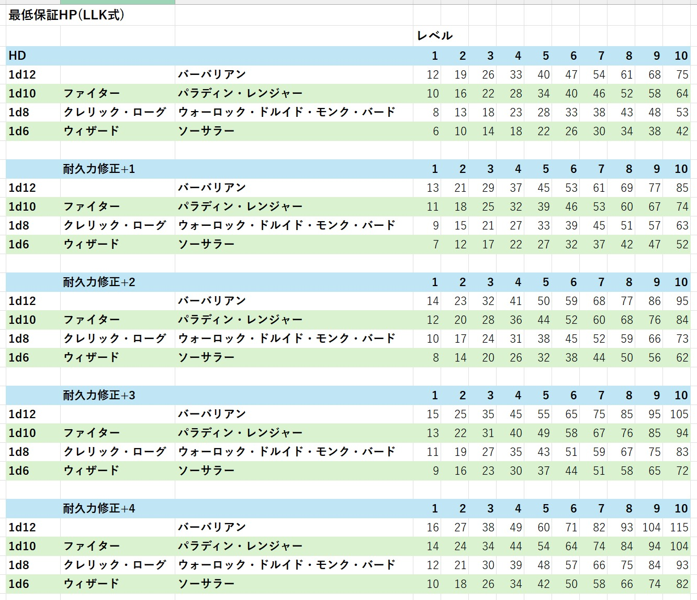
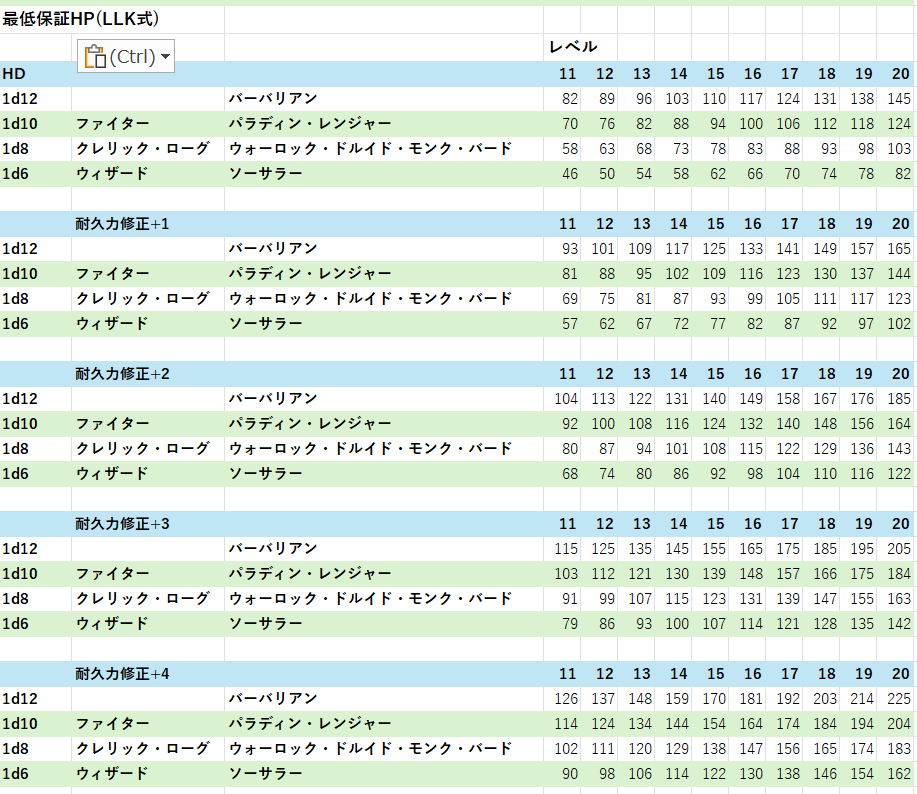

# ハウスルール: 最低保証HP について

## ■ コンセプト
- レベルごとに最低保証をするのではなく、**全レベルを通して最低保証することで、サイコロを振っていても、上振れしすぎず、最低値も保証される**ようにする

## ■ ルールの詳細
- **レベルアップ時**: 現在HPにヒットダイスを振り、出目と耐久力ボーナスを加算する
- **計算後のHPの修正**: 加算結果が最低保証値より低ければ、保証値になる
- 保証値 は 以下で計算する : 
    - *Lv1初期値+(レベルx耐久力ボーナス)+((レベル-1)xLvアップ固定値)*

## ■ 計算後の数値

## ■出典
- [2026年02月 LLK例会 最低保証HPについて](./../../2026-02-04)